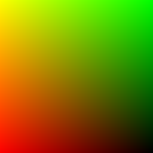
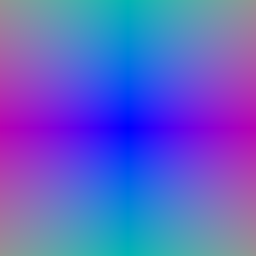
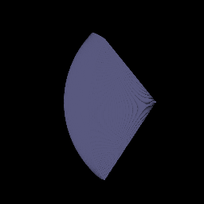
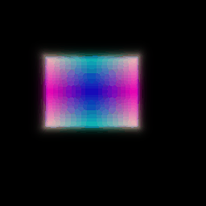
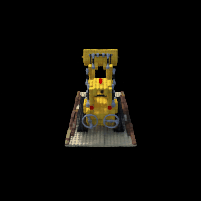

Assignment 3
===================================

Rohan Agarwal (rohanaga)

Late days: 2

## Question 1
### 1.3. Ray sampling Visualizations

 


###  1.4. Point sampling Visualization



### 1.5. Volume rendering Visualization
 

##  Question 2. Optimizing a basic implicit volume

```
Box center: (0.2502, 0.2506, -0.0005)
Box side lengths: (2.0051, 1.5036, 1.5034)
```




##  Question 3. Optimizing a Neural Radiance Field (NeRF) 

Rendering with positional encoding but without view dependence:


##  Question 4. NeRF Extras

###  4.1 View Dependence Visualization

Rendering with positional encoding and view dependence.


Comments:

1. Light-dependent effects are rendered much better. For instace, the shadows on the base of the bulldozer and the 
shine on the blade of the bulldozer when facing towards the light are more apparent. 
2. Viewpoint conditioning is added after after density estimation i.e. much later in the network because:
    a) it only affects the color component and 
    b) exposing the whole network to view encoding may lead to over fitting.
3. NeRF allows for arbitrary lighting and is rather too flexible. Without enforcing a physically-informed lighting model, 
NeRF can tend to have low generalization power i.e. it can perform poorly when cameras are imprecise and viewpoints
are sparse.


###  4.3 High Resolution Imagery Visualization





Comments:

1. Higher fine-grained details ( for instance the lego base or the grey grill-like structure 
on the front of the bulldozer and the shaft joints) are visible with high-res rendering. The effect of viewpoint conditioning 
is also much more apparent on the lego base and on the blade of the bulldozer where you can see shadows. 
2. However, it takes a significant increase in the network capacity (depth, number of hidden dimensions, position and 
 view dependence encoding to achieve a higher representational power. This means, while NeRF allows for rendering arbitrarily 
 resolutions, it comes at the cost of high computation power.


I experimented with two configuration:

High resolution (400 x 400) with medium network capacity:
```
  batch_size: 1024
  image_size: [400, 400]
  chunk_size: 32768
  n_harmonic_functions_xyz: 8
  n_harmonic_functions_dir: 3
  n_hidden_neurons_xyz: 128  
  n_hidden_neurons_dir: 64
  n_layers_xyz: 7
  append_xyz: [3]
```
High resolution (400 x 400) with high network capacity:
```
  batch_size: 512
  chunk_size: 8192
  n_harmonic_functions_xyz: 10
  n_harmonic_functions_dir: 4
  n_hidden_neurons_xyz: 256
  n_hidden_neurons_dir: 128
  n_layers_xyz: 8
  append_xyz: [4]
 ```
  
As expected, the rendering with a higher network capacity has a sharper rendering. The smaller network also results
in more spurious rendering which reflects as flickering in the redering (can be seen on a closer look). 
    
But what I find worth-noting is the fact that the network parameters had to increase more than 4 times in number 
for what doesn't seem like a lot of improvement visually. This again points towards how the computation requirement 
for training can scale significantly even for small improvements in rendering quality.
  
  

```
